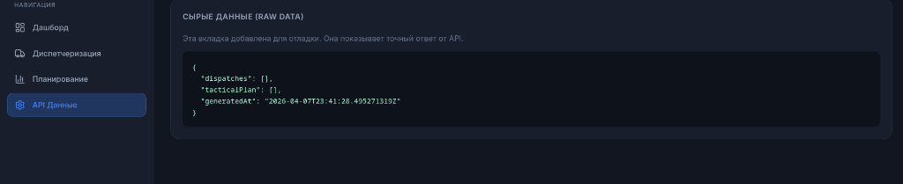
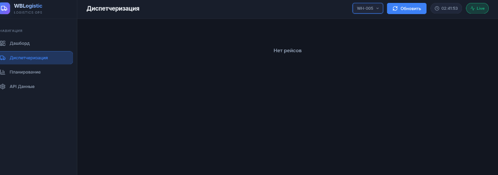

# WBLogistic SealsTeam

Automated Transportation Dispatch System and Logistics Operations Dashboard. 
The system provides a real-time view of warehouse operations, AI-based micro dispatching (SLA control, fill rates), and macro tactical planning (forecasts and truck requirements).

## Architecture

The project is built using a microservices architecture and is fully containerized with Docker Compose.

### Core Services

*   Frontend (React + Vite): Port 3000
*   Backend (Java Spring Boot REST API): Port 8080
*   ML Engine (Python FastAPI): Port 8000
*   Database (PostgreSQL): Port 5432

## Screenshots

Dashboard Overview (Planning View):


Detailed Dashboard (Single Warehouse):


## Getting Started

1.  Clone the repository.
2.  Start the entire stack using Docker Compose:
    `docker compose up --build -d`
3.  Access the web interface at:
    `http://localhost:3000`

## Features

*   Multi-warehouse monitoring.
*   Automated creation of dispatch requests.
*   Urgent Dispatch panel for manual overrides and rapid anomaly response.
*   Tactical planning overview (7-day ahead forecast by ML).
*   Data export to CSV.
*   Cross-filtering, sorting, and slide-out action panels.

## CI/CD Pipeline

The repository includes a GitHub Actions workflow (`.github/workflows/ci.yml`) that automatically verifies code integrity on every pull request and push to the release branches. 

The pipeline performs:
*   Java backend build validation.
*   Python automated tests and static analysis.
*   React frontend build verification.
*   Docker Compose configuration test and full image composition.

Automated Transportation Dispatch System and Logistics Operations Dashboard. 
The system provides a real-time view of warehouse operations, AI-based micro dispatching (SLA control, fill rates), and macro tactical planning (forecasts and truck requirements).

## Architecture

The project is built using a microservices architecture and is fully containerized with Docker Compose.

### Core Services

*   Frontend (React + Vite): Port 3000
*   Backend (Java Spring Boot REST API): Port 8080
*   ML Engine (Python FastAPI): Port 8000
*   Database (PostgreSQL): Port 5432

## Screenshots

Dashboard Overview (Planning View):


Detailed Dashboard (Single Warehouse):


## Getting Started

1.  Clone the repository.
2.  Start the entire stack using Docker Compose:
    `docker compose up --build -d`
3.  Access the web interface at:
    `http://localhost:3000`

## Features

*   Multi-warehouse monitoring.
*   Automated creation of dispatch requests.
*   Urgent Dispatch panel for manual overrides and rapid anomaly response.
*   Tactical planning overview (7-day ahead forecast by ML).
*   Data export to CSV.
*   Cross-filtering, sorting, and slide-out action panels.

## CI/CD Pipeline

The repository includes a GitHub Actions workflow (`.github/workflows/ci.yml`) that automatically verifies code integrity on every pull request and push to the release branches. 

The pipeline performs:
*   Java backend build validation.
*   Python automated tests and static analysis.
*   React frontend build verification.
*   Docker Compose configuration test and full image composition.

## File Structure

```bash
WBLogistic_SealsTeam/
├── data/                                    # Raw datasets
├── docs/                                    # Documentation and media
├── models/                                  # ML Model weights
├── config/                                  # Python configuration files
├── src/
│   ├── ml_pipeline/                         # Offline model training
│   ├── backend_service/                     # Python FastAPI (ML Engine + Logic)
├── backend-java/                            # Java Spring Boot
├── frontend-web/                            # React Frontend
├── tests/                                   # Python test suite
├── docker-compose.yml                       # Production orchestration
├── pyproject.toml                           # Python dependencies
└── .github/workflows/ci.yml                 # CI/CD Pipeline
```
